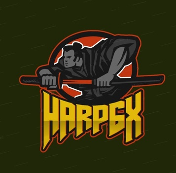

# Bio

**Who am I:** Uddip Ranjan Das		

**Known as:** Harp6x

**What do I do:** Ethical Hacker & Red Teamer

**Where am I:** India

**Certifications:** Advance Diploma in Information Security

_References_

**GitHub:** [https://github.com/harp6x](https://github.com/harp6x)

**Linkedin:** [https://www.linkedin.com/in/harp6x](https://www.linkedin.com/in/harp6x/)

**Twitter:** [@harp6x](https://www.twitter.com/harp6x/)

**HackTheBox:** 

**Contact:** uddip9@gmail.com, harp6x@protonmail.ch

**PGP Key:** [Here](https://raw.githubusercontent.com/harp6x/harp6x.github.io/master/harp6x%20PGP%20Public%20Key.asc)

**Keybase:** [https://keybase.io/harp6x](https://keybase.io/harp6x)

 

# Posts

**posts/first post**
