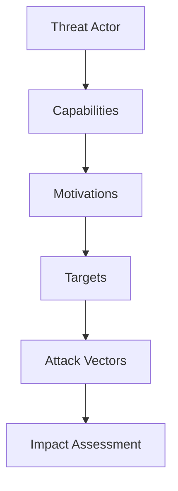

# Threat Intelligence Fundamentals: Building a CTI Program

*Published on January 5, 2024*

## Introduction

Cyber Threat Intelligence (CTI) is the collection, analysis, and dissemination of information about cyber threats. A well-structured CTI program can significantly enhance an organization's security posture by providing actionable insights into potential threats.

## Types of Threat Intelligence

### Strategic Intelligence
- High-level threat landscape analysis
- Threat actor motivations and capabilities
- Industry-specific threat trends
- Executive decision support

### Tactical Intelligence
- Specific threat actor TTPs
- Malware families and capabilities
- Attack vectors and techniques
- Technical indicators

### Operational Intelligence
- Real-time threat feeds
- IOC sharing and correlation
- Incident response support
- Threat hunting guidance

## Intelligence Lifecycle

### 1. Planning and Direction

Define intelligence requirements:
- What threats are most relevant?
- What information do we need?
- How will intelligence be used?
- Who are the stakeholders?

### 2. Collection

Gather information from multiple sources:

```python
# Example: Threat feed collection
import requests
import json

def collect_threat_feeds():
    feeds = [
        "https://api.abuseipdb.com/api/v2/blacklist",
        "https://urlhaus.abuse.ch/downloads/csv/",
        "https://raw.githubusercontent.com/firehol/blocklist-ipsets/master/firehol_level1.netset"
    ]
    
    for feed in feeds:
        response = requests.get(feed)
        if response.status_code == 200:
            process_feed_data(response.text)
```

### 3. Processing

Transform raw data into structured intelligence:

- **Data normalization**
- **Deduplication**
- **Enrichment**
- **Validation**

### 4. Analysis

Apply analytical techniques:

- **Pattern recognition**
- **Trend analysis**
- **Threat modeling**
- **Risk assessment**

### 5. Dissemination

Share intelligence with stakeholders:

- **Automated alerts**
- **Regular reports**
- **Briefings**
- **Integration with security tools**

## Intelligence Sources

### Open Source Intelligence (OSINT)

- **Social media monitoring**
- **Dark web forums**
- **Security blogs and reports**
- **Public threat feeds**
- **Vulnerability databases**

### Commercial Intelligence

- **Threat intelligence platforms**
- **Security vendor reports**
- **Industry-specific feeds**
- **Professional services**

### Internal Intelligence

- **Security logs**
- **Incident reports**
- **Network telemetry**
- **User behavior analytics**

## Intelligence Tools and Platforms

### Open Source Tools

```bash
# MISP - Threat intelligence sharing
git clone https://github.com/MISP/MISP.git
cd MISP
./INSTALL/INSTALL.sh

# YARA - Pattern matching
pip install yara-python

# TheHive - Case management
docker run -d -p 9000:9000 thehive4/thehive4
```

### Commercial Platforms

- **Recorded Future**: Threat intelligence platform
- **FireEye iSIGHT**: Threat intelligence
- **IBM X-Force Exchange**: Threat intelligence sharing
- **Anomali STAXX**: Threat intelligence feeds

## Intelligence Analysis Techniques

### Threat Modeling



### Indicator Analysis

- **IOC correlation**
- **TTP mapping**
- **Campaign attribution**
- **Threat actor profiling**

### Trend Analysis

- **Attack frequency**
- **Target industry patterns**
- **Geographic distribution**
- **Temporal patterns**

## Intelligence Products

### Daily Threat Briefs

- **Top threats of the day**
- **New vulnerabilities**
- **Active campaigns**
- **Recommended actions**

### Weekly Intelligence Reports

- **Threat landscape overview**
- **Trend analysis**
- **Case studies**
- **Strategic recommendations**

### Monthly Executive Summaries

- **High-level threat assessment**
- **Risk analysis**
- **Strategic implications**
- **Resource recommendations**

## Integration with Security Operations

### SIEM Integration

```python
# Example: SIEM alert enrichment
def enrich_alert_with_intel(alert):
    iocs = get_relevant_iocs(alert)
    threat_actors = get_attribution(iocs)
    ttp = get_ttp_mapping(alert)
    
    return {
        'alert': alert,
        'intelligence': {
            'iocs': iocs,
            'threat_actors': threat_actors,
            'ttp': ttp,
            'risk_score': calculate_risk_score(iocs, threat_actors)
        }
    }
```

### Incident Response

- **Threat context for incidents**
- **IOC hunting guidance**
- **Attribution support**
- **Response recommendations**

### Threat Hunting

- **Hypothesis development**
- **Hunting playbooks**
- **Tool selection**
- **Analysis support**

## Best Practices

1. **Define clear requirements**: Understand what intelligence is needed and why
2. **Use multiple sources**: Don't rely on a single intelligence source
3. **Validate information**: Verify intelligence before acting on it
4. **Share intelligence**: Contribute to the broader security community
5. **Measure effectiveness**: Track how intelligence improves security outcomes
6. **Automate where possible**: Use tools to process and disseminate intelligence
7. **Maintain context**: Understand the broader threat landscape

## Challenges and Solutions

### Common Challenges

- **Information overload**
- **False positives**
- **Timeliness**
- **Relevance**
- **Integration complexity**

### Solutions

- **Automated filtering and scoring**
- **Contextual analysis**
- **Real-time feeds**
- **Customized intelligence**
- **API-based integration**

## Conclusion

Effective threat intelligence requires a structured approach, the right tools, and continuous refinement. The goal is to transform raw threat data into actionable intelligence that enhances security decision-making and incident response capabilities.

Remember: Intelligence is only valuable if it's actionable, timely, and relevant to your organization's specific needs.

---

*For more threat intelligence insights, follow me on [LinkedIn](https://www.linkedin.com/in/harp6x) and [Twitter](https://twitter.com/harp6x).* 